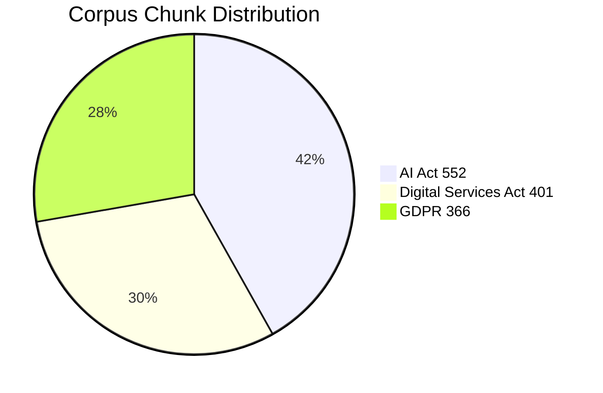
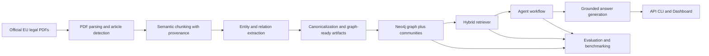
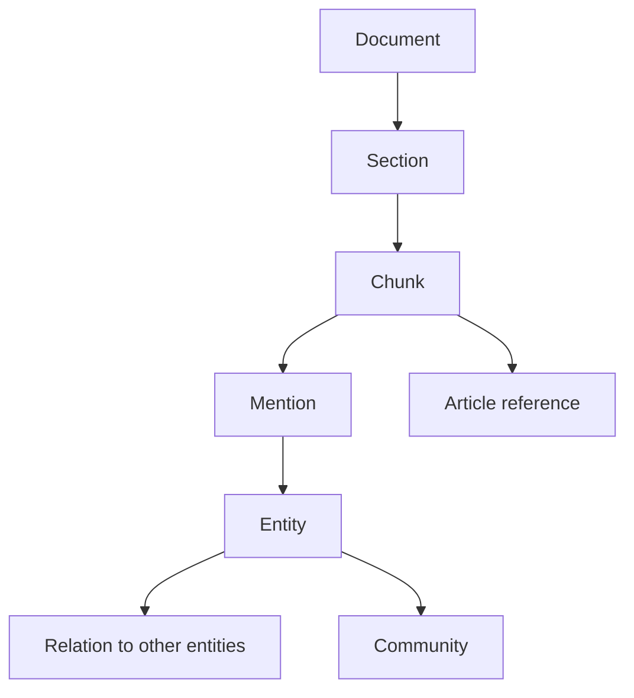
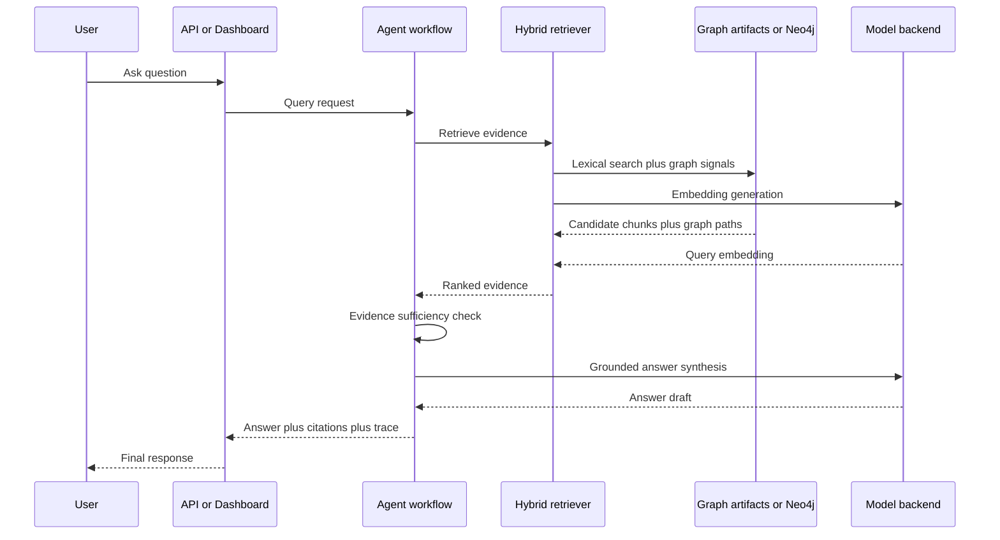

# GraphRAG Engine


Production-style GraphRAG for the EU AI Act, GDPR, and the Digital Services Act, with article-aware ingestion, graph construction, hybrid retrieval, provenance-grounded answers, a FastAPI service, a modular Streamlit workspace, and a benchmark harness that compares GraphRAG against a simpler baseline.

## Table Of Contents

- [Short Abstract](#short-abstract)
- [Deep Introduction](#deep-introduction)
- [The Entire System Explained](#the-entire-system-explained)
- [Performance Validation And Quality](#performance-validation-and-quality)
- [Detailed Deployment Guide](#detailed-deployment-guide)
- [Development Notes](#development-notes)
- [References](#references)

## Short Abstract

This project is a local-first regulatory intelligence system. It reads raw EU legal PDFs, breaks them into article-aware chunks, extracts entities and relationships, builds a knowledge graph in Neo4j, and answers user questions using a hybrid retrieval strategy that combines vector search, lexical matching, and graph traversal.

In simple terms, this is not just "search over PDFs." It is a system that tries to understand how concepts in the law connect to each other, then uses those connections to produce answers with citations and traceable evidence.

At the time of this validated snapshot on **March 19, 2026**, the repository contains:

- `3` ingested regulations
- `1319` indexed chunks
- `557` extracted entities
- `3408` extracted relationships
- `147` detected graph communities
- `54` benchmark cases comparing GraphRAG to a baseline retrieval path
- `17` passing unit and integration tests in the project environment

The latest stored benchmark shows GraphRAG outperforming the baseline on overall score, context precision, answer relevancy, and multi-hop accuracy.

## Deep Introduction

### What problem this project solves

Large legal documents are hard to use well.

Even when a document is public and searchable, finding the *right* answer is difficult because:

- the answer may be split across multiple articles
- one article may define a concept while another article sets the obligation
- legal language often depends on cross-references and exceptions
- plain keyword search can retrieve the right words but the wrong legal meaning

This project is built to address that problem.

Instead of treating the law as one long document, the system turns it into a structured knowledge base:

- documents become sections and chunks
- chunks become evidence units with provenance
- important concepts become entities
- relationships between concepts become graph edges
- the final answer is generated from retrieved evidence rather than free-floating model memory

### What GraphRAG means in plain English

If you are new to GraphRAG, here is the simplest way to think about it:

- **Normal RAG** finds text that looks similar to your question.
- **GraphRAG** still does that, but it also keeps a map of how concepts connect.

Imagine asking:

> "What does Article 6 require for high-risk AI systems?"

A plain RAG system might retrieve any chunk mentioning "high-risk AI systems."

A GraphRAG system can do more:

- identify that `Article 6` is a specific legal anchor
- prioritize AI Act chunks instead of unrelated regulations
- follow links from `Article 6` to `AI system`, `high-risk`, `Annex III`, or related obligations
- rank evidence using both semantic similarity and graph structure
- return the answer with the exact supporting chunks and graph paths

That is the core idea behind this repository.

### What this project is for

This project serves several purposes at once:

- a flagship portfolio project for GraphRAG engineering
- a serious demonstration of end-to-end AI product building
- a legal and regulatory question-answering system over official EU law
- a benchmark environment for comparing plain RAG vs graph-augmented retrieval
- a learning tool for understanding ingestion, graph modeling, retrieval, evaluation, APIs, dashboards, and deployment

### What makes this repo different from a demo

This repository is intentionally built like a product, not like a notebook experiment.

It includes:

- structured source code under `src/`
- typed models and settings
- CLI commands for operators
- FastAPI endpoints for programmatic access
- a Streamlit application for end users and operators
- Docker Compose for local orchestration
- health endpoints
- evaluation fixtures and benchmark output
- tests and release notes
- in-app documentation

### Current validated corpus snapshot

The current corpus and graph artifacts in the repository reflect:

| Corpus / graph signal | Current validated value |
| --- | ---: |
| Documents | `3` |
| Total chunks | `1319` |
| Entities | `557` |
| Relations | `3408` |
| Communities | `147` |
| Neo4j load | `true` |

Chunk distribution across the three regulations:



Top extracted entity groups in the current graph:

| Entity type | Count |
| --- | ---: |
| `article_topic` | `310` |
| `article` | `121` |
| `obligation` | `71` |
| `section_topic` | `17` |
| `right` | `11` |
| `actor` | `8` |

## The Entire System Explained

This section explains the whole system from raw document to final answer.

### 1. High-level architecture



At a high level, the system has three layers:

1. **Offline knowledge build**  
   Raw legal documents are parsed, chunked, enriched, and transformed into graph artifacts.

2. **Online runtime**  
   User questions trigger hybrid retrieval, optional graph expansion, and grounded answer generation.

3. **Product and operations layer**  
   The resulting system is exposed through a CLI, API, dashboard, health endpoints, and benchmark tooling.

### 2. The full build pipeline

#### 2.1 Corpus ingestion

The ingestion pipeline reads the raw PDFs from `data/raw/` and converts them into structured records.

What happens here:

- PDF text is extracted page by page
- headings and article markers are detected
- sections are segmented
- text is broken into chunks sized for retrieval and generation
- each chunk keeps source metadata

Every chunk is designed to retain provenance such as:

- document name
- article reference
- section title
- page range
- stable chunk ID
- text hash

This is the foundation for traceable answers later.

#### 2.2 Entity and relation extraction

Once chunked text exists, the extraction phase tries to identify meaningful legal units and their relationships.

Examples of entity types include:

- regulations
- articles
- obligations
- actors
- rights
- risk classes
- topical sections

Examples of relations include:

- article references another article
- article covers a topic
- an obligation applies to an actor
- a topic links to a legal concept

The current implementation supports multiple model backends behind one provider abstraction:

- `local`
- `openai`
- `anthropic`
- `gemini`
- `heuristic`
- `auto`

For this machine, the validated local defaults are:

```env
GRAPH_RAG_MODEL_BACKEND=local
GRAPH_RAG_LOCAL_CHAT_MODEL=Qwen/Qwen2.5-1.5B-Instruct
GRAPH_RAG_LOCAL_EMBEDDING_MODEL=sentence-transformers/all-MiniLM-L6-v2
GRAPH_RAG_LOCAL_DEVICE=auto
```

#### 2.3 Graph construction

After extraction, the system builds a knowledge graph and persists it in Neo4j.

The graph contains at least these conceptual elements:

- documents
- sections
- chunks
- entities
- relationships
- community labels

The graph is useful because a legal answer often depends on *connected meaning*, not just textual similarity.

For example:

- one article defines high-risk classification
- another article describes provider obligations
- another article explains conformity assessment

A graph makes these linkages first-class instead of accidental.

### 3. The graph data model



In practical terms:

- `Document` represents a source regulation
- `Section` captures a chapter or article section
- `Chunk` is the retrieval unit
- `Entity` is a canonical concept extracted from text
- `Relation` expresses how entities connect
- `Community` groups related entities after graph analysis

### 4. Query-time architecture

When a user asks a question, the system does not jump straight to text generation. It runs a retrieval and reasoning pipeline first.



### 5. How hybrid retrieval works

The retriever combines multiple signals:

- **Vector similarity**  
  Semantic closeness between the query and chunk embeddings.

- **Lexical overlap**  
  Token-level overlap, useful for exact article references and legal phrases.

- **Metadata alignment**  
  Boosts chunks that match article references or document hints like "AI Act" or "GDPR."

- **Graph score**  
  Uses entity matches and graph traversal paths to reward chunks that sit near relevant concepts.

The scores are fused with reciprocal rank fusion plus additional weighting.

This matters because legal retrieval benefits from more than one type of search:

- vector search helps with semantic meaning
- lexical search helps with exact statute language
- graph traversal helps with cross-reference reasoning

### 6. The agent workflow

The agent layer coordinates the answering process.

Its job is to:

- analyze the incoming question
- run retrieval
- check whether the evidence looks sufficient
- optionally rewrite or expand the search
- generate a grounded answer from the retrieved evidence
- package citations, graph paths, and trace metadata

The repository uses a LangGraph-style workflow and is organized so the retrieval path is inspectable, bounded, and testable rather than an opaque chain of prompts.

### 7. What the user actually sees

The application exposes several surfaces:

| Surface | Purpose |
| --- | --- |
| CLI | Build, rebuild, query, and evaluate the system from the terminal |
| FastAPI | Programmatic access, health checks, and machine-to-machine workflows |
| Streamlit Dashboard | User-facing workspace for chat, ops, corpus exploration, and documentation |
| Neo4j Browser | Direct graph inspection and debugging |

The Streamlit app currently includes:

- **Home** for system posture, benchmark summary, and app navigation
- **Chat** for grounded Q and A with compare mode
- **Corpus Explorer** for browsing chunks by regulation and article
- **Ops** for graph and evaluation visibility
- **Project Guide** for in-app documentation

### 8. Why this architecture is useful

This design is especially strong for regulation-heavy domains because it gives you:

- source-aware retrieval
- article disambiguation
- inspectable provenance
- better multi-hop reasoning than plain similarity search
- a clearer operator story for debugging why an answer happened

## Performance Validation And Quality

This project is evaluated as a real system, not just described conceptually.

### 1. Current benchmark snapshot

The repository includes a stored evaluation run at:

- [`data/processed/evaluation/eval_2fca346db6561871.json`](data/processed/evaluation/eval_2fca346db6561871.json)

That benchmark compares a baseline retrieval path against GraphRAG across `54` cases.

#### Aggregate benchmark table

| Metric | Baseline | GraphRAG | Delta |
| --- | ---: | ---: | ---: |
| Average score | `0.3583` | `0.3815` | `+6.48%` |
| Faithfulness | `0.7148` | `0.6593` | `-7.76%` |
| Context precision | `0.2667` | `0.3000` | `+12.49%` |
| Answer relevancy | `0.2407` | `0.2778` | `+15.41%` |
| Multi-hop accuracy | `0.2111` | `0.2889` | `+36.85%` |

#### Visual comparison

```mermaid
xychart-beta
    title "Benchmark Comparison Across 54 Cases"
    x-axis ["Average", "Faithfulness", "Context", "Relevancy", "MultiHop"]
    y-axis "Score" 0 --> 1
    bar "Baseline" [0.3583, 0.7148, 0.2667, 0.2407, 0.2111]
    bar "GraphRAG" [0.3815, 0.6593, 0.3000, 0.2778, 0.2889]
```



### 2. What these metrics mean

If you are not used to evaluation jargon, here is the practical meaning:

- **Average score**  
  A combined summary of overall answer quality.

- **Faithfulness**  
  Whether the answer stays anchored to retrieved evidence instead of inventing unsupported claims.

- **Context precision**  
  Whether the retrieved evidence was actually relevant.

- **Answer relevancy**  
  Whether the answer addressed the question directly.

- **Multi-hop accuracy**  
  Whether the system handled questions that depend on more than one reasoning step.

The benchmark result tells a clear story:

- GraphRAG is better than the baseline on overall quality
- GraphRAG is materially better at multi-hop reasoning
- GraphRAG retrieves more relevant context
- faithfulness still deserves ongoing monitoring and refinement

That is exactly the kind of tradeoff you want to see surfaced honestly in a serious repository.

### 3. Graph-scale validation

The latest graph build stats are stored in:

- [`data/processed/graph/load_stats.json`](data/processed/graph/load_stats.json)

Current validated graph build:

| Graph build signal | Value |
| --- | ---: |
| Documents loaded | `3` |
| Chunks loaded | `1319` |
| Entities loaded | `557` |
| Relations loaded | `3408` |
| Communities detected | `147` |
| Used Neo4j | `true` |

### 4. Tests and quality gates

The repository currently passes:

- `17` project tests in the validated environment
- `compileall` across `dashboard`, `src`, and `tests`
- health endpoint checks on the API
- end-to-end query validation using the local backend

Core validation commands:

```powershell
python -m unittest discover -s tests
python -m compileall dashboard src tests
graphrag-engine doctor
graphrag-engine run-eval
```

### 5. Retrieval quality notes

A key practical validation milestone in this repo is article disambiguation.

For example, the system was tuned so that questions like:

```text
What does Article 6 require for high-risk AI systems?
```

prefer the correct `AI Act Article 6` evidence instead of drifting into another regulation or unrelated article.

This is a very important quality signal in regulatory QA because many laws share similar language and overlapping topic names.

### 6. Speed and runtime characteristics

This system can run fully local, but speed depends heavily on hardware and backend choice.

Current runtime reality:

- retrieval is usually much cheaper than generation
- first-run latency is highest because models and caches warm up
- local generation is slower than hosted frontier APIs
- the current local path is optimized for **working offline and staying inspectable**, not for lowest possible latency

On this machine, the validated local stack uses:

- `Qwen/Qwen2.5-1.5B-Instruct` for chat and reasoning
- `sentence-transformers/all-MiniLM-L6-v2` for embeddings
- GPU-enabled PyTorch in the `RAGenv` environment

This is a strong local development setup, but it is still consumer-hardware inference, not a high-throughput production inference cluster.

## Detailed Deployment Guide

This project is designed to run in two practical ways:

1. directly on the host machine
2. through Docker Compose

Both are useful.

- Use **direct local run** when you want the simplest development loop.
- Use **Docker Compose** when you want reproducible local orchestration.

### 1. Prerequisites

#### Required

- Python `3.11+`
- Conda if you want to use the recommended `RAGenv`
- the three official PDFs in `data/raw/`

#### Recommended

- Docker Desktop for Compose-based startup
- an NVIDIA GPU for faster local inference
- Neo4j running either through Docker Compose or a local instance

### 2. Environment setup

Copy the template:

```powershell
Copy-Item .env.example .env
```

Important environment variables:

```env
GRAPH_RAG_MODEL_BACKEND=local
GRAPH_RAG_LOCAL_CHAT_MODEL=Qwen/Qwen2.5-1.5B-Instruct
GRAPH_RAG_LOCAL_EMBEDDING_MODEL=sentence-transformers/all-MiniLM-L6-v2
GRAPH_RAG_LOCAL_DEVICE=auto
GRAPH_RAG_NEO4J_URI=bolt://localhost:7687
GRAPH_RAG_NEO4J_USER=neo4j
GRAPH_RAG_NEO4J_PASSWORD=change-me-now
GRAPH_RAG_API_KEY=
```

Notes:

- `GRAPH_RAG_API_KEY` is optional but recommended if you want `/v1/*` API protection.
- If you do not have OpenAI, Anthropic, or Gemini keys, the local backend is enough to run the project.
- The host machine should keep `GRAPH_RAG_NEO4J_URI=bolt://localhost:7687`.
- Docker automatically overrides that to `bolt://neo4j:7687` for container-to-container traffic.

### 3. Recommended Windows bootstrap

This repository includes a bootstrap script:

```powershell
.\scripts\bootstrap_windows.ps1
```

That script:

- creates `RAGenv`
- installs the package in editable mode with local extras
- prepares the project for Windows-based development

### 4. Direct local deployment

#### Step 1: activate the environment

```powershell
conda activate RAGenv
python -m pip install -e ".[dev,local]"
```

#### Step 2: place source PDFs

Put the official English PDFs in:

```text
data/raw/
```

Expected documents:

- AI Act
- GDPR
- Digital Services Act

#### Step 3: build the knowledge base

```powershell
graphrag-engine doctor
graphrag-engine ingest
graphrag-engine extract
graphrag-engine build-graph
graphrag-engine reindex
graphrag-engine run-eval
```

#### Step 4: start the API

```powershell
python -m uvicorn graphrag_engine.api.app:app --host 127.0.0.1 --port 8000
```

#### Step 5: start the dashboard

In another terminal:

```powershell
streamlit run dashboard/Home.py --server.headless true --server.address 127.0.0.1 --server.port 8501
```

#### Step 6: open the application

- Dashboard: `http://127.0.0.1:8501`
- API: `http://127.0.0.1:8000`
- API docs: `http://127.0.0.1:8000/docs`
- Neo4j Browser: `http://localhost:7474`

### 5. Docker Compose deployment

The repository includes:

- [`docker-compose.yml`](docker-compose.yml)
- [`Dockerfile`](Dockerfile)

The Compose stack starts:

- `neo4j`
- `api`
- `dashboard`

To launch:

```powershell
docker compose up -d --build
```

To inspect:

```powershell
docker compose ps
docker compose logs -f api
docker compose logs -f dashboard
docker compose logs -f neo4j
```

To stop:

```powershell
docker compose down
```

### 6. Health checks and verification

The API exposes:

- `GET /health/live`
- `GET /health/ready`
- `GET /health`
- `GET /v1/system/status`

Check readiness:

```powershell
curl http://localhost:8000/health/live
curl http://localhost:8000/health/ready
curl http://localhost:8000/v1/system/status
```

If `GRAPH_RAG_API_KEY` is set, use:

```powershell
curl -H "X-API-Key: your-key" http://localhost:8000/v1/system/status
```

### 7. Deployment hardening checklist

Before sharing or deploying beyond your own machine:

- change the default Neo4j password
- set `GRAPH_RAG_API_KEY`
- review `.env` and remove unused provider keys
- confirm `data/` and Neo4j volumes persist correctly
- run the benchmark again after major changes
- confirm the dashboard answers at least one representative legal question correctly
- confirm citations point to the correct regulation and article

### 8. Troubleshooting

#### Docker is not starting

- ensure Docker Desktop is running
- run `docker compose ps`
- inspect container logs

#### Neo4j is unavailable

- verify port `7687` is open
- confirm the password in `.env` matches the running Neo4j instance
- if using Docker, ensure the `neo4j` service is healthy before `api` starts

#### Local model is too slow

- expect the first run to be the slowest
- keep the local backend for development and offline use
- use a stronger hosted backend later if you need better latency or stronger reasoning

#### Dashboard loads but answers are empty

- run `graphrag-engine doctor`
- confirm the PDFs exist in `data/raw/`
- rebuild the artifacts with `ingest`, `extract`, and `build-graph`
- check that `data/processed/graph/graph_catalog.json` exists

## Development Notes

### 1. Repository structure

```text
src/graphrag_engine/
  agent/        Query planning and orchestration
  api/          FastAPI service
  cli/          Operator CLI
  common/       Config, logging, providers, typed models, storage helpers
  evaluation/   Benchmark fixtures, metrics, and evaluation service
  extraction/   Entity and relation extraction
  generation/   Grounded answer synthesis
  graph/        Neo4j loading and community detection
  ingestion/    PDF parsing and chunking
  retrieval/    Hybrid retrieval and score fusion
dashboard/      Streamlit multi-page application
configs/        Evaluation fixtures and config
data/           Raw PDFs, processed artifacts, and caches
tests/          Unit and integration tests
```

### 2. Backend design philosophy

The project is built around a provider abstraction so the rest of the system does not need to care whether the active model backend is:

- local
- OpenAI
- Anthropic
- Gemini
- heuristic fallback

That means ingestion, graph building, retrieval, API routes, and dashboard logic do not have to be rewritten every time the model backend changes.

### 3. Why Neo4j is central in v1

This project intentionally uses a lean Neo4j-centric design because it provides:

- graph persistence
- graph traversal
- a strong local operator story
- a simpler system footprint than introducing many services at once

This keeps the architecture serious without making the first release unnecessarily fragmented.

### 4. Why local Qwen is the default here

The current validated local configuration uses:

- `Qwen/Qwen2.5-1.5B-Instruct`
- `sentence-transformers/all-MiniLM-L6-v2`

Why:

- it runs on consumer hardware
- it allows offline development
- it avoids blocking the project on paid API access
- it is sufficient for a serious local-first build

Hosted providers remain useful for stronger final validation, but they are optional.

### 5. Graceful degradation

The repository is designed so work can continue even when some optional pieces are missing:

- if Neo4j is unavailable, local graph artifacts still exist
- if hosted keys are missing, local or heuristic backends can still run
- tests can still validate core logic without every optional dependency being live

### 6. Current known limits

This is a serious system, but it still has honest limits:

- local generation is slower than hosted frontier APIs
- benchmark numbers are good, but still worth improving
- graph scale is strong for a real local build, but not the final ceiling
- deployment hardening is partly configurable and still needs conscious operator setup

### 7. Additional internal project documentation

For deeper project notes beyond this README, see:

- [`docs/project_overview.md`](docs/project_overview.md)
- [`docs/architecture.md`](docs/architecture.md)
- [`docs/user_guide.md`](docs/user_guide.md)
- [`docs/operations_runbook.md`](docs/operations_runbook.md)
- [`docs/release_checklist.md`](docs/release_checklist.md)
- [`docs/reproduce_results.md`](docs/reproduce_results.md)

## References

### Official legal sources

- EU AI Act: <https://eur-lex.europa.eu/eli/reg/2024/1689/oj/eng>
- GDPR: <https://eur-lex.europa.eu/eli/reg/2016/679/oj/eng>
- Digital Services Act: <https://eur-lex.europa.eu/eli/reg/2022/2065/oj/eng>

### Technology references

- Neo4j Documentation: <https://neo4j.com/docs/>
- FastAPI Documentation: <https://fastapi.tiangolo.com/>
- Streamlit Documentation: <https://docs.streamlit.io/>
- LangGraph Documentation: <https://docs.langchain.com/oss/python/langgraph/overview>
- Sentence Transformers Documentation: <https://sbert.net/>
- Qwen2.5 1.5B Instruct model card: <https://huggingface.co/Qwen/Qwen2.5-1.5B-Instruct>

### Project evidence in this repository

- Graph load stats: [`data/processed/graph/load_stats.json`](data/processed/graph/load_stats.json)
- Latest benchmark output: [`data/processed/evaluation/eval_2fca346db6561871.json`](data/processed/evaluation/eval_2fca346db6561871.json)
- Release checklist: [`docs/release_checklist.md`](docs/release_checklist.md)
- Reproducibility guide: [`docs/reproduce_results.md`](docs/reproduce_results.md)

---

If you are reading this as a builder: this repository is meant to be understandable, inspectable, and extensible.

If you are reading it as a reviewer: the most important thing to inspect is not just whether the answer looks good, but whether the answer is traceable back to the correct evidence.
