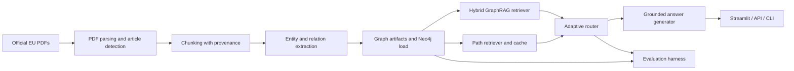
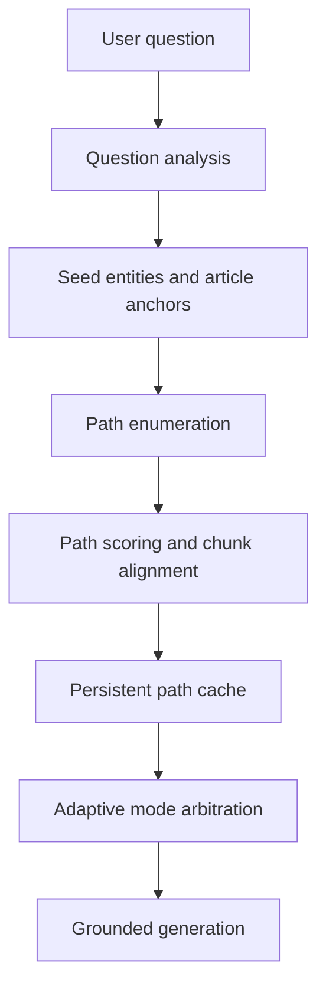
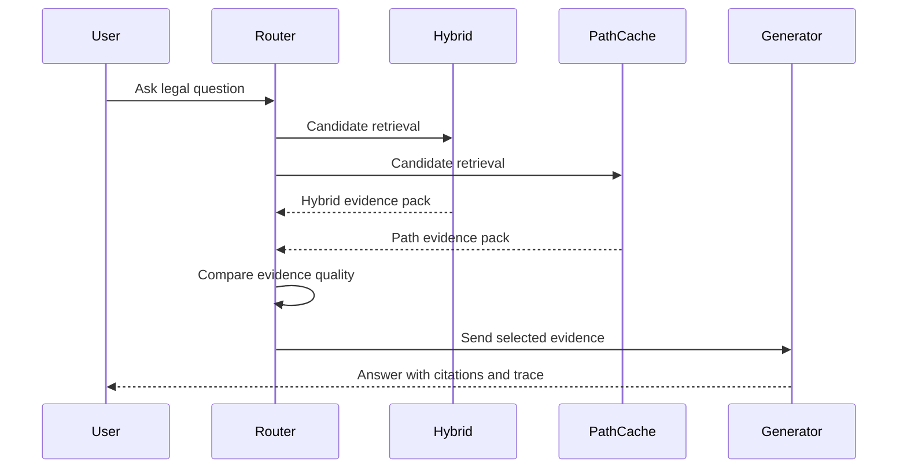
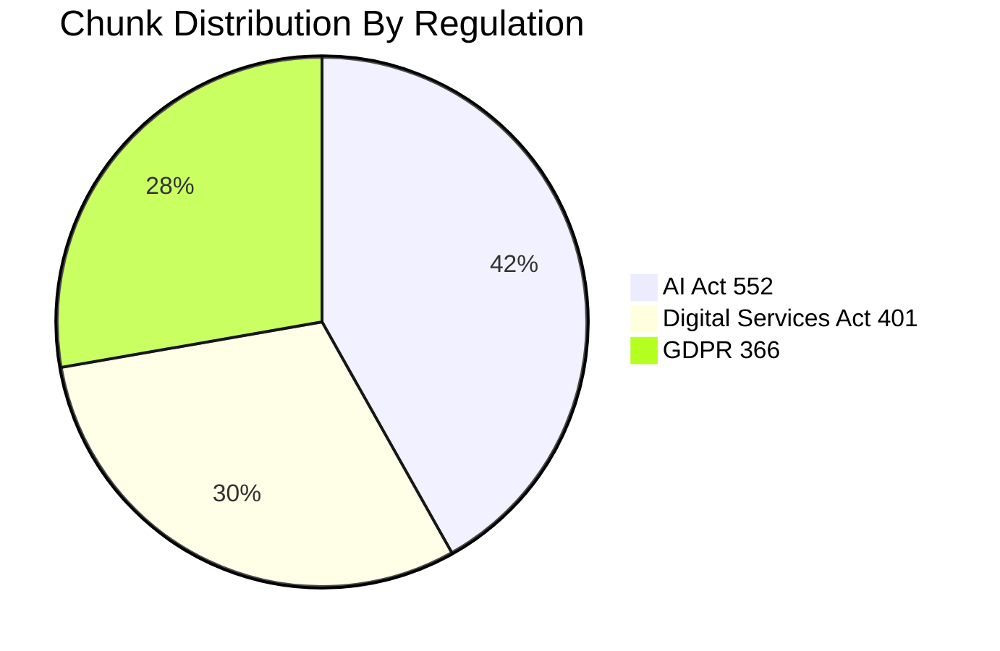
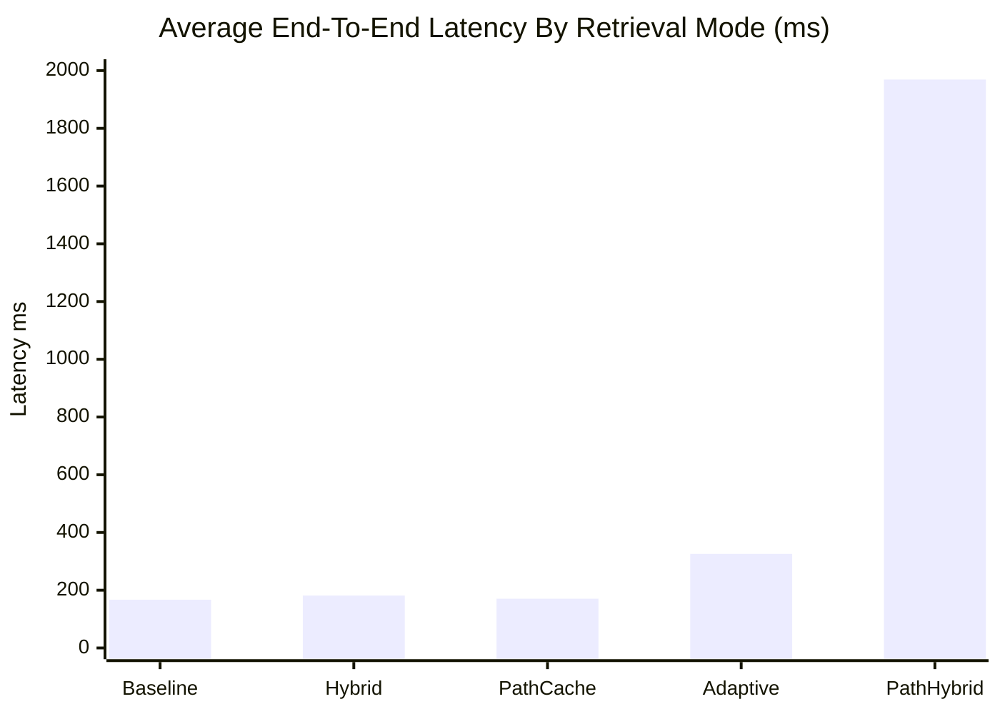

# GraphRAG Engine / PathCacheRAG


Production-style regulatory intelligence over the EU AI Act, GDPR, and the Digital Services Act, with two connected retrieval stories:

- a strong hybrid GraphRAG baseline
- a PathCacheRAG branch that adds path-centric retrieval, persistent path caching, and adaptive evidence arbitration

## Table Of Contents

- [Short Abstract](#short-abstract)
- [Deep Introduction](#deep-introduction)
- [The Entire System Explained](#the-entire-system-explained)
- [Performance Validation And Quality](#performance-validation-and-quality)
- [Detailed Deployment Guide](#detailed-deployment-guide)
- [Development Notes](#development-notes)
- [References](#references)

## Short Abstract

This repository turns three dense EU regulations into a queryable legal intelligence system. It ingests the official PDFs, performs article-aware chunking, extracts entities and relations, builds a Neo4j-backed knowledge graph, and answers questions with citations and graph evidence.

The PathCacheRAG branch extends that base system with a more novel retrieval design:

- graph paths become first-class evidence
- repeated legal routes are cached as reusable path packs
- an adaptive router compares candidate retrieval modes before choosing the final evidence path

This is not a template or toy demo. It is a real local-first project with a working dashboard, CLI, API, graph build pipeline, evaluation harness, reproducibility docs, and release-oriented engineering structure.

Current validated snapshot for this branch:

| Signal | Value |
| --- | ---: |
| Source regulations | `3` |
| Indexed chunks | `1319` |
| Canonical entities | `557` |
| Relations | `3408` |
| Graph communities | `147` |
| Evaluation cases | `54` |
| Passing tests | `21` |
| Best benchmark mode | `adaptive` |

## Deep Introduction

### What problem this project solves

Legal texts are public, but that does not make them easy to use.

Even when a regulation is searchable, the real answer often depends on:

- a specific article anchor
- a definition in one place and an obligation in another
- cross-references to annexes or adjacent provisions
- relationships between actors, systems, risks, and duties

Normal retrieval-augmented generation often stops at "this chunk looks similar to your question." That is useful, but it is not enough for regulation-heavy reasoning.

This project pushes further by treating the corpus as both:

- text that can be searched semantically and lexically
- a graph of connected legal concepts that can be traversed, ranked, and explained

### What GraphRAG means in plain English

The simplest explanation is:

- plain RAG retrieves chunks
- GraphRAG retrieves chunks plus structure

If you ask:

> What does Article 6 require for high-risk AI systems?

a plain retriever may fetch any paragraph containing "high-risk AI systems."

This system instead tries to:

- recognize `Article 6` as a legal anchor
- prioritize the correct regulation
- follow graph relationships from that anchor to related obligations and concepts
- rank evidence using both text similarity and graph signals
- generate an answer from grounded evidence only

### What PathCacheRAG adds

PathCacheRAG is the branch-level innovation in this repository.

Instead of only asking "which chunks look relevant?", it can also ask:

- which graph paths best explain this legal question?
- have we already seen and cached a similar legal route?
- if multiple retrieval modes disagree, which evidence pack looks stronger?

That leads to a system that is more:

- interpretable
- reusable on repeated legal questions
- interesting as a research or portfolio artifact
- aligned with multi-hop legal reasoning

### What this repository is for

This repo serves several real purposes:

- a flagship GraphRAG and PathCacheRAG engineering project
- a serious portfolio system for AI, backend, and applied retrieval work
- a local-first legal intelligence app
- a benchmark environment for comparing retrieval strategies
- a learning platform for ingestion, graph modeling, evaluation, UI, APIs, and deployment

## The Entire System Explained

### System Map



### Layer 1: Corpus Ingestion

The raw PDFs live in `data/raw/`. The ingestion pipeline reads them, detects headings and articles, and turns them into structured chunks with stable metadata.

Each chunk keeps:

- document name
- article reference when available
- page span
- section title
- stable chunk ID
- source text hash

This provenance matters because every answer needs traceable evidence.

### Layer 2: Extraction And Graph Build

The extraction phase identifies legal entities and relations, then normalizes them into graph-ready records.

Examples:

- regulations
- articles
- obligations
- actors
- rights
- risk classes
- article topics

These records are persisted into a graph catalog and loaded into Neo4j. The graph is then enriched with community labels so the retrieval layer can reason over connected clusters, not only isolated chunks.

### Layer 3: GraphRAG Retrieval

The base GraphRAG runtime combines:

- lexical overlap
- vector similarity
- metadata and article alignment
- graph/entity signals
- reciprocal rank fusion

This is the strong general-purpose baseline on the branch.

### Layer 4: PathCacheRAG Retrieval

PathCacheRAG adds a new evidence object: the graph path.



In this layer the system:

- expands candidate legal paths from seed entities
- scores them using entity match, relation confidence, article alignment, and document alignment
- converts the best paths into chunk-grounded evidence
- optionally reuses cached path packs on repeated questions

### Layer 5: Adaptive Arbitration

The branch default is `adaptive`.

It does not blindly pick one retrieval mode. It:

1. inspects question signals
2. proposes candidate modes such as `hybrid` and `path_cache`
3. evaluates the returned evidence packs
4. selects the strongest route
5. stores that decision in the response trace for inspection



### Layer 6: Product Surfaces

The system is exposed through:

- `Streamlit` for end-user and operator workflows
- `FastAPI` for programmable access
- `CLI` for pipeline and evaluation commands
- `Docker Compose` for local orchestration

The dashboard is intentionally modular:

- `Home` for posture and benchmark overview
- `Chat` for grounded query execution
- `Ops` for jobs, graph health, evaluation, artifacts, cache status, and adaptive routing analytics
- `Corpus Explorer` for source-level inspection
- `Path Explorer` for path retrieval and adaptive routing inspection
- `Project Guide` for in-app documentation

## Performance Validation And Quality

### Validated Corpus Snapshot

The current graph build on this branch shows:

| Metric | Value |
| --- | ---: |
| Documents loaded | `3` |
| Chunks loaded | `1319` |
| Entities loaded | `557` |
| Relations loaded | `3408` |
| Communities detected | `147` |
| Neo4j load used | `true` |

Chunk distribution:



Top entity groups in the current graph:

| Entity type | Count |
| --- | ---: |
| `article_topic` | `310` |
| `article` | `121` |
| `obligation` | `71` |
| `section_topic` | `17` |
| `right` | `11` |
| `actor` | `8` |

### Benchmark Snapshot

Latest validated evaluation artifact:

- file: `data/processed/evaluation/eval_2fca346db6561871.json`
- total cases: `54`

| Mode | Avg score | Faithfulness | Context precision | Answer relevancy | Multi-hop accuracy | Avg latency ms | Cache hit rate |
| --- | ---: | ---: | ---: | ---: | ---: | ---: | ---: |
| `adaptive` | `0.3704` | `0.6778` | `0.3000` | `0.2593` | `0.2444` | `325.85` | `0.2222` |
| `hybrid` | `0.3658` | `0.6593` | `0.3000` | `0.2593` | `0.2444` | `181.49` | `0.0000` |
| `path_cache` | `0.3556` | `0.6593` | `0.3111` | `0.2407` | `0.2111` | `170.58` | `1.0000` |
| `path_hybrid` | `0.3556` | `0.6593` | `0.3111` | `0.2407` | `0.2111` | `1969.03` | `0.0000` |
| `baseline` | `0.3491` | `0.7148` | `0.2667` | `0.2037` | `0.2111` | `167.08` | `0.0000` |

#### Visual Comparison

```mermaid
xychart-beta
    title "Benchmark Comparison Across 54 Cases"
    x-axis ["Average", "Faithfulness", "Context", "Relevancy", "MultiHop"]
    y-axis "Score" 0 --> 1
    bar "Baseline" [0.3491, 0.7148, 0.2667, 0.2037, 0.2111]
    bar "Hybrid" [0.3658, 0.6593, 0.3000, 0.2593, 0.2444]
    bar "PathCache" [0.3556, 0.6593, 0.3111, 0.2407, 0.2111]
    bar "Adaptive" [0.3704, 0.6778, 0.3000, 0.2593, 0.2444]
```



#### Latency Comparison



What these numbers mean:

- `adaptive` is the best overall retrieval mode on the branch
- `hybrid` remains a strong fixed-mode baseline
- `path_cache` gives the clearest repeat-query cache story
- `path_hybrid` is the most exploratory and the slowest

### Adaptive Routing Analytics

The branch now persists adaptive route decisions under `data/processed/analytics/adaptive_routes.jsonl`.

Latest recorded snapshot after the benchmark rerun:

| Signal | Value |
| --- | ---: |
| Recorded route events | `88` |
| Hybrid selections | `64` |
| Path cache selections | `24` |
| Cache hit rate | `0.2727` |
| Preselect match rate | `0.6477` |
| Average route latency ms | `167.15` |

### Validation Commands

Validated in the project environment:

```powershell
conda activate RAGenv
python -m unittest discover -s tests
python -m compileall dashboard src tests
python -m graphrag_engine.cli.main doctor
python -m graphrag_engine.cli.main route-analytics
python -m graphrag_engine.cli.main run-eval
```

### Reproducibility

The metrics in this README are not placeholders. They come from generated artifacts in `data/processed/`.

See:

- `docs/reproduce_results.md`
- `docs/pathcache_rag_spec.md`

## Detailed Deployment Guide

### 1. Recommended Environment

Use the Conda environment already prepared for the project:

```powershell
conda activate RAGenv
python -m pip install -e ".[dev,local]"
```

### 2. Required Inputs

Place these PDFs into `data/raw/`:

- `OJ_L_202401689_EN_TXT.pdf`
- `CELEX_32016R0679_EN_TXT.pdf`
- `CELEX_32022R2065_EN_TXT.pdf`

### 3. Local Model Setup

Validated local stack on this machine:

- chat model: `Qwen/Qwen2.5-1.5B-Instruct`
- embedding model: `sentence-transformers/all-MiniLM-L6-v2`

Useful health check:

```powershell
python -m graphrag_engine.cli.main doctor
```

### 4. Build The Knowledge Base

```powershell
python -m graphrag_engine.cli.main ingest
python -m graphrag_engine.cli.main extract
python -m graphrag_engine.cli.main build-graph
python -m graphrag_engine.cli.main reindex
python -m graphrag_engine.cli.main run-eval
```

### 5. Run The App Locally

API:

```powershell
python -m uvicorn graphrag_engine.api.app:app --host 127.0.0.1 --port 8000
```

Dashboard:

```powershell
streamlit run dashboard/Home.py
```

Open:

- Dashboard: `http://127.0.0.1:8501`
- API docs: `http://127.0.0.1:8000/docs`
- Neo4j browser: `http://127.0.0.1:7474`

### 6. Use The CLI

Representative commands:

```powershell
python -m graphrag_engine.cli.main query "What does Article 6 require for high-risk AI systems?" --mode adaptive --top-k 6
python -m graphrag_engine.cli.main path-cache-stats
python -m graphrag_engine.cli.main clear-path-cache
python -m graphrag_engine.cli.main run-eval
```

### 7. Use Docker Compose

```powershell
docker compose up --build
```

Health checks:

```powershell
curl http://localhost:8000/health/live
curl http://localhost:8000/health/ready
curl http://localhost:8000/v1/system/status
```

### 8. Deployment Hygiene

Before any serious shared deployment:

- change default Neo4j credentials
- set `GRAPH_RAG_API_KEY` if you want API protection
- verify mounted volumes for `data/`
- keep the benchmark artifact and README in sync with the branch you ship
- validate the selected backend one more time with `doctor`

## Development Notes

### Important Branch Context

`main` is the flagship GraphRAG repo.

`PathCacheRAG` is the experimental but serious branch that adds:

- path-centric retrieval
- persistent path caching
- adaptive retrieval arbitration
- a dedicated path inspection interface

### Key Files

- `src/graphrag_engine/retrieval/service.py`
- `src/graphrag_engine/retrieval/path_cache.py`
- `src/graphrag_engine/agent/workflow.py`
- `src/graphrag_engine/evaluation/service.py`
- `dashboard/pages/5_Path_Explorer.py`
- `docs/pathcache_rag_spec.md`

### Honest Limitations

This branch is strong, but not magical.

- Local generation is slower than hosted frontier APIs.
- Adaptive routing improves quality, but sometimes increases end-to-end latency because it compares candidate evidence packs.
- The benchmark is real and useful, but still lightweight compared with a large enterprise legal evaluation stack.
- External providers are implemented, but not all are live-validated without user-supplied keys.
- Internet-facing deployment still needs stricter security hardening than local-first usage.

### What Counts As Complete Here

For this branch, "complete" means:

- real corpus ingested
- graph built
- path modes implemented
- adaptive route selection implemented
- benchmark saved
- tests passing
- dashboard and docs updated

That bar is met for a strong v1 branch release.

## References

- EU AI Act official text: https://eur-lex.europa.eu/eli/reg/2024/1689/oj/eng
- GDPR official text: https://eur-lex.europa.eu/eli/reg/2016/679/oj/eng
- Digital Services Act official text: https://eur-lex.europa.eu/eli/reg/2022/2065/oj/eng
- GraphRAG: https://arxiv.org/abs/2404.16130
- PathRAG: https://arxiv.org/abs/2502.14902
- CAG: https://arxiv.org/abs/2412.15605
- ColBERTv2: https://aclanthology.org/2022.naacl-main.272/
- RAPTOR: https://arxiv.org/abs/2401.18059
- HippoRAG: https://arxiv.org/abs/2405.14831
